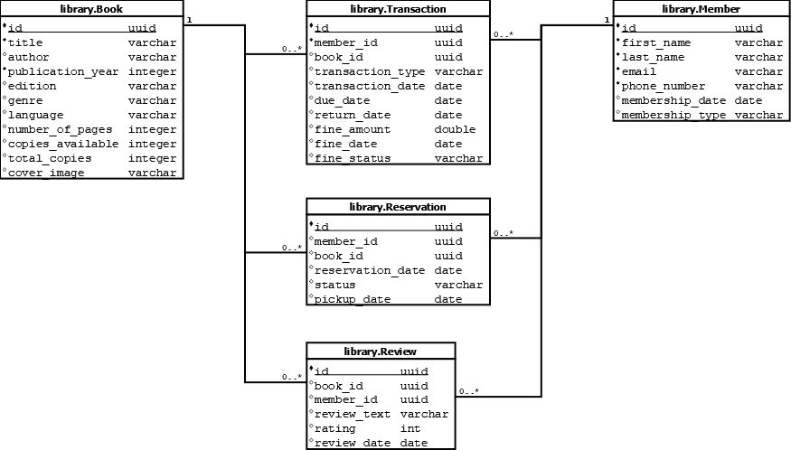

# Library database

## Database model

### Model description

A library has a collection of books. A book has a title, an author, and is published in a certain year for a given edition. Books are associated with a genre. A book has a set number of pages for the given edition and language. The library contains a number of copies of the edition.

Members of the library can rent out books for a set time (in days). If the book was not returned within this period, a fine will be imposed. Members can also make reservations for books that are not available at the current time. Members can rate the books that they rented out.

### Entities

Below, an overview of the datamodel is given in the entity relationship diagram (ERD).

library.member:
- id (primary key, uuid)
- first_name
- last_name
- email
- phone_number
- password
- username

library.book:
- id (primary key, integer)
- isbn
- isbn13
- title
- author
- publisher
- publication_year
- publication_language
- genre
- number_of_pages
- number_of_copies

library.book_loan:
- id (primary key, uuid)
- member_id
- book_id
- checkout_date
- due_date
- return_date
- fine_amount
- fine_status
- fine_status_date

library.book_reservation:
- id (primary key, uuid)
- member_id
- book_id
- reservation_date
- status
- pickup_date

library.book_review:
- id (primary key, uuid)
- book_id
- member_id
- rating
- review_date

