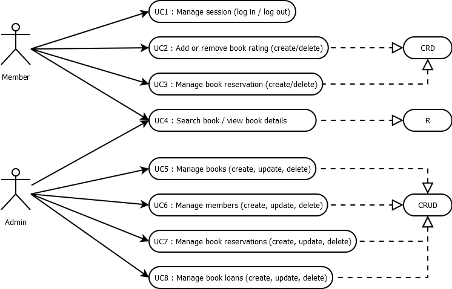

# Library - requirements analysis

## Use cases

There are two actors in the system:
- Member: a user who can
    - log into the system with their login and password,
    - make reservations for books, and
    - can rate books in the library.
- Admin: a user who can:
    - add and manage books in the library,
    - add and manage members,
    - add a book loan for a given book and member, and
    - manage reservations.

These operations are summarized in the use case diagram below.

